# 🤖 AI Home Assistant

[](https://www.typescriptlang.org/)
[](https://reactjs.org/)
[](https://nodejs.org/)
[](https://expressjs.com/)
[](https://vitejs.dev/)


👋 **Hi there! Welcome to my AI Home Assistant project.**

I built this application to explore how we can create **context-aware conversational interfaces** using modern web technologies and local Large Language Models (LLMs). It's a friendly assistant designed to help with household tasks, offer companionship, and demonstrate the power of maintaining conversation history.

## 🚀 How It Works

Curious about the magic behind the scenes? Here's a peek at the data flow:

```mermaid
sequenceDiagram
    actor User
    participant Frontend as ⚛️ React Frontend
    participant Backend as 🚀 Express Backend
    participant Ollama as 🦙 Ollama LLM

    User->>Frontend: Sends message ("Hello")
    Frontend->>Frontend: Updates local state (Optimistic UI)
    Frontend->>Backend: POST /chat { messages: [...] }
    
    Note over Backend: Validates request with Zod
    
    Backend->>Ollama: POST /api/chat
    Note right of Ollama: Processes context & generates reply
    Ollama-->>Backend: Returns generated response
    
    Backend-->>Frontend: Returns { reply: "..." }
    Frontend->>User: Displays AI response
```



1.  **You speak**: You type a message in the React frontend.
2.  **We remember**: The frontend sends your message *plus* the conversation history to the backend.
3.  **We process**: The Node.js backend validates everything and talks to **Ollama** (running locally).
4.  **AI responds**: The LLM generates a thoughtful response based on the full context.

## 🛠️ Tech Stack

I chose this stack to balance **performance, type safety, and developer experience**:

*   **Backend**: Node.js + Express (Robust and scalable)
*   **Frontend**: React + Vite (Fast and interactive)
*   **Language**: TypeScript (Catching bugs before they happen!)
*   **Validation**: Zod (Ensuring data integrity)
*   **AI Engine**: Ollama (Running powerful models like Phi-3 locally)

## 📂 Project Structure

I've organized the project to keep things clean and modular:

```
ai-assistant-api/
├── server/                 # 🧠 The Brain (Backend)
│   ├── src/
│   │   ├── controllers/    # Handling requests
│   │   ├── services/       # Business logic
│   │   ├── utils/          # LLM magic
│   │   └── ...
│   └── Dockerfile
├── client/                 # 💅 The Face (Frontend)
│   ├── src/
│   │   ├── App.tsx         # Main UI logic
│   │   └── ...
│   └── Dockerfile
└── docker-compose.yml      # 🐳 Orchestration
```

## 🏃‍♂️ Getting Started

Want to run this yourself? Let's get you set up!

### Prerequisites
*   **Docker** (Recommended for easiest setup)
*   *Or* Node.js v18+ and Ollama installed locally.

### Option 1: The "I want it now" way (Docker) 🐳

1.  **Clone the repo**:
    ```bash
    git clone https://github.com/yourusername/ai-assistant-api.git
    cd ai-assistant-api
    ```

2.  **Launch everything**:
    ```bash
    docker compose up --build
    ```

3.  **Explore**: Open `http://localhost:5173` and say hello!

### Option 2: The "Hacker" way (Manual) 💻

If you prefer running things manually:

1.  **Start Ollama**: `ollama serve` (and pull a model like `ollama pull phi3`).
2.  **Server**: `cd server && npm install && npm run dev`
3.  **Client**: `cd client && npm install && npm run dev`

## 🧪 Testing

I believe in robust code! Run the test suite to verify the backend logic:

```bash
cd server
npm test
```

---

*Built with ❤️ and ☕ by Nicolás.*
